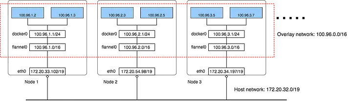

# KUBERNETES

- kubernetes or k8s is an open-source orchestration and cluster management for container-based applications maintained by the Cloud Native     Computing Foundation.
- Kubernetes helps in scaling applications,load-balancing, self-healing, and rolling updates, making it well-suited for running containers.

**Kubernetes Installation script**
   
    sudo apt-get update -y
    sudo apt-get install -y apt-transport-https ca-certificates curl

    sudo curl -fsSL https://pkgs.k8s.io/core:/stable:/v1.30/deb/Release.key | sudo gpg --dearmor -o /etc/apt/keyrings/kubernetes-apt-keyring.gpg

    sudo mkdir -p -m 755 /etc/apt/keyrings

    sudo curl -fsSL https://pkgs.k8s.io/core:/stable:/v1.30/deb/Release.key | sudo gpg --dearmor -o /etc/apt/keyrings/kubernetes-apt-keyring.gpg
    echo 'deb [signed-by=/etc/apt/keyrings/kubernetes-apt-keyring.gpg] https://pkgs.k8s.io/core:/stable:/v1.30/deb/ /' | sudo tee /etc/apt/sources.list.d/kubernetes.list

    sudo apt-get update

    sudo apt-get install -y kubelet kubeadm kubectl

    sudo apt-mark hold kubelet kubeadm kubectl
    sudo sed -i '/ swap / s/^\(.*\)$/#\1/g' /etc/fstab
    sudo swapoff -a
    sudo modprobe overlay
    sudo modprobe br_netfilter

    sudo tee /etc/sysctl.d/kubernetes.conf<<EOF
    net.bridge.bridge-nf-call-ip6tables = 1
    net.bridge.bridge-nf-call-iptables = 1
    net.ipv4.ip_forward = 1
    EOF

    sudo sysctl --system

    sudo tee /etc/modules-load.d/containerd.conf <<EOF
    overlay
    br_netfilter
    EOF

    sudo sysctl --system

    curl -fsSL https://download.docker.com/linux/ubuntu/gpg | sudo apt-key add -

    sudo add-apt-repository "deb [arch=amd64] https://download.docker.com/linux/ubuntu $(lsb_release -cs) stable"

    sudo apt update

    sudo apt install -y containerd.io

    mkdir -p /etc/containerd

    containerd config default | sudo tee /etc/containerd/config.toml

    sudo systemctl restart containerd

    sudo systemctl enable containerd

    sudo systemctl enable kubelet

    kubectl version

    sudo kubeadm config images pull --cri-socket /run/containerd/containerd.sock --kubernetes-version v1.30.0

    sudo kubeadm init   --pod-network-cidr=10.244.0.0/16   --upload-certs --kubernetes-version=v1.30.0  --control-plane-endpoint=ip --ignore-preflight-errors=all  --cri-socket /run/containerd/containerd.sock

    mkdir -p $HOME/.kube

    sudo cp -i /etc/kubernetes/admin.conf $HOME/.kube/config

    sudo chown $(id -u):$(id -g) $HOME/.kube/config

    kubectl apply -f https://github.com/coreos/flannel/raw/master/Documentation/kube-flannel.yml
    

 **Kubernetes Architecture**
 - All the important components of control-plane(master node) & worker node of kubernetes.
 - Following are the components of Kubernetes Master Machine.

   **control-plane(master-node)** - It is responsible for managing the cluster ,in production environment it works on multiple nodes that span across several data zones.api-server - It stores the configuration information which can be used by each of the nodes in the cluster. 

      1. api-server is the primary interface between the control-plane and the rest of the cluster ,it exposes a api that allow client to interact with control plane and submit request to manage the cluster.

      2. etcd - etcd is a distributed key:value store,it store the cluster persistent state .It is used by the api-server and other components of the control plane to store and retrieve information about cluster's.

      3. Scheduler- the scheduler is responsible for scheduling pods onto the worker nodes in the cluster.It uses information about the resources required by the pods and the available resources on the worker node.

      4. Controller-manager - The controller manager is responsible for running controllers that manage the state of the cluster.

  **Worker-node** - These nodes run the containerized application workload,the containerized application run in a pod.pods are the smallest deployable unit in kubernetes,pod host one or more containers.

   **The core components of kubernetes that run on the worker node are**

   1. Kubelet - the kubelet is a daemon that run on each worker node,it is responsible for communicating with control plane.It receieve information from control plane for which pod to run on the node and ensures that the desired state of the pod is maintained.

   2. Container-Runtime - The container runtime runs the container on worker nodes,it is responsible for pulling the container image from the registry,starting and stopping the containers and managing the container's resources.

   3. Kube-proxy - The kube-proxy is the network proxythat runs on each worker node,it is responsible for routing traffic to the correct pods and it also provide load-balancing for the pods and ensures traffic is distributed evenly across the pods.

 **1. KIND - pod** 
 - pods-Pods are the smallest deployable units of computing that you can create and manage in Kubernetes.
 - A Pod is a group of one or more containers, with shared storage and network resources, and a specification for how to run the containers.
 - A Pod's contents are always co-located and co-scheduled, and run in a shared context.

   - Field of the yaml file
    -  apiVersion - Which version of the Kubernetes API we are using to create this object
    -  kind - What kind of object you want to create
    -  metadata - Data that helps uniquely identify the object
    -  spec - What state you desire for the object

**Commands to launch pod through ad-hoc commands**

    
    #command to create new pod
    kubectl run <podname> --image=image name
    kubectl get pods
    kubectl describe pod <podname>
    kubectl exec -it <container name/id> bash
    

**yaml file to launch pod**

    
      apiVersion: v1
      kind: Pod
        metadata:
           name: webapp
      spec:
        containers:
          - name: nginx
            image: nginx:latest
            ports:
              - containerPort: 80
    

**command to run manifest file for pod**

 kubectl create -f filename

    
**2. KIND - DEPLOYMENT**
 - Deployment - A Kubernetes Deployment tells Kubernetes how to create or modify instances of the pods that hold a containerized application.
 - Deployments can help to efficiently scale up and scale down the number of replica pods.
 - We can describe a desired state in a Deployment,and the deployment controller changes the actual state to the desired state.
 - We can define Deployments to create new ReplicaSets, or to remove existing Deployments and adopt all their resources with new Deployments.
  
 **Ad-hoc commands for deployment**
    
    # to create new deployment
      kubectl create deployment <deploymentname> --image=image name
    # to check status of deployment
      kubectl get deployment
    # to check all the info of deployment
      kubectl describe deployment <deployment name>
    # to delete deployment
      kubectl delete deployment <deployment name>  
    # to scale up and down the replicas
      kubectl scale deployment <deployment name> --replicas=no
    # to check status of replicaset 
      kubectl get replicaset
    # to check info of replicaset 
      kubectl describe replicaset <name>            
    

**yaml file for deployment**

apiVersion: apps/v1
kind: Deployment
metadata:
  name: nginx-app
  labels:
    app: nginx
spec:
  replicas: 5
  selector:
    matchLabels:
      app: nginx
  template:
    metadata:
      labels:
        app: nginx
    spec:
      containers:
      - name: nginx
        image: nginx:latest
        ports:
        - containerPort: 80


**commands to create deployment through yaml file**

 kubectl create -f filename

**command to create & run the deployment**

 kubectl apply -f filename

**Kubernetes Replication-Controller & Kubernetes-Replica-set**

1. Replication controller - A ReplicationController ensures that a specified number of pod replicas are running at any one time or it ensures that a pod or a homogeneous set of pods is always up and available.
- The pods maintained by a ReplicationController are automatically replaced if they fail, are deleted, or are terminated. For example, your pods are re-created on a node after disruptive maintenance such as a kernel upgrade. 
- Replication-controller support rolling update,it means it allows a  update to take place with zero downtime. It does this by incrementally replacing the current Pods with new ones. The new Pods are scheduled on Nodes with available resources, and Kubernetes waits for those new Pods to start before removing the old Pods.

**Manifest file for kind replication controller**

  
    apiVersion: v1
    kind: ReplicationController
    metadata:
      name: nginx
    spec:
      replicas: 5
      selector:
        app: nginx
      template:
        metadata:
          name: nginx
          labels:
            app: nginx
        spec:
          containers:
          - name: nginx
            image: nginx
            ports:
            - containerPort: 80
  

2. Replica-set - A ReplicaSet's purpose is to maintain a stable set of replica Pods running at any given time. As such, it is often used to guarantee the availability of a specified number of identical Pods, it does not support rolling update feature It is responsible for monitoring the health of the modules it manages and ensuring that the required number of replicas are always running, thus providing self-healing capabilities. ReplicaSet automatically detect and recover from module failures by creating new replicas to replace the failed ones, ensuring that the desired state of the application is maintained. With their self-healing feature, ReplicaSet contribute to the overall resilience and high availability of applications in Kubernetes clusters.

**Manifest file for Replica-set**


apiVersion: apps/v1
kind: ReplicaSet
metadata:
  name: frontend
  labels:
    app: web-app
    tier: frontend
spec:
  replicas: 3
  selector:
    matchLabels:
      app: web-app
  template:
    metadata:
      labels:
        app: web-app
    spec:
      containers:
      - name: web
        image: nginx
        ports:
        - containerPort: 80
  
     

## kubernetes network
-  A CNI plugin is required to implement the Kubernetes network model.

- CNI- Container Network Interface (CNI) is a framework for dynamically configuring networking resources. It uses a group of libraries and specifications written in Go. The plugin specification defines an interface for configuring the network, provisioning IP addresses, and maintaining connectivity with multiple hosts.

- The network model is implemented by the container runtime on each node. The container runtimes use Container Network Interface (CNI) plugins to manage their network and security capabilities and many different CNI plugins exist from many different vendors for example Flannel,  Calico , Weave and many more.

- Once you’ve specified the type of network configuration type, the container runtime defines the network that containers join. The runtime adds the interface to the container namespace via a call to the CNI plugin and allocates the connected subnetwork routes via calls to the IP Address Management (IPAM) plugin.
- 

- CNI can integrate smoothly with the kubelet to enable the use of an overlay or underlay network to automatically configure the network between pods. Overlay networks encapsulate network traffic using a virtual interface such as Virtual Extensible LAN (VXLAN). Underlay networks work at the physical level and comprise switches and routers.

    

1. Kind- Service

- Service - In Kubernetes, a Service is a method for exposing a network application that is running as one or more Pods in our cluster.
- We use a Service to make that set of Pods available on the network so that clients can interact with it.

- Kubernetes Service types allow us to specify what kind of Service we want.The available type values and their behaviors are:-
1. Cluster-IP - Exposes the Service on a cluster-internal IP. Choosing this value makes the Service only reachable from within the cluster. This is the default type that is used if we don't explicitly specify a type for a Service. This service type is used when we don't want to the
service to outside world

   
    apiVersion: v1
    kind: Service
    metadata:
      name: Backend
    spec:
      type: ClusterIP
      ports:
        - targetPort: 80
          port: 80
      selector:
        name: my-demo-pod 
   

2. NodePort - NodePort service in Kubernetes is a service that is used to expose the application to the internet from where the end-users can access it.It will also expose the applications which are running in the node it also allows the traffic from the outside to reach the application with the help of NodePort.

- The NodePort port must be in the range between 30000 to 32767 and if we don’t specify the NodePort value Kubernetes will assign it randomly.
  

   
      apiVersion: apps/v1
      kind: Deployment
      metadata:
        name: web-app
      spec:
        replicas: 3
        selector:
          matchLabels:
            app: web-containers
        template:
          metadata:
            labels:
              app: web-containers
          spec:
            containers:
            - image: nginx:latest
              name: web
              ports:
              - containerPort: 80
        ---
      apiVersion: v1
      kind: Service
      metadata:
        name: nginx-service
      spec:
        selector:
          app: web-containers
        ports:
        - port: 80
          protocol: TCP
          targetPort: 80
        type: NodePort
 
     

 3. Load balancer -  A Kubernetes load balancer is a component that distributes network traffic across multiple instances of an application running in a K8S cluster. It acts as a traffic manager, ensuring that incoming requests are evenly distributed among the available instances to optimize performance and prevent overload on any single node, providing high availability and scalability.
 
-  The LoadBalancer service type is built on top of NodePort service types by provisioning and configuring external load balancers from cloud providers.
-   Load balancers in K8S can be implemented by using a cloud provider-specific load balancer such as Azure Load Balancer, AWS Network Load Balancer (NLB), or Elastic Load Balancer (ELB).

- Manifest file for service type - LoadBalancer
  
  
    apiVersion: v1
    kind: Service
    metadata:
      name: example-service
    spec:
      selector:
        app: example
      ports:
        - port: 8765
          targetPort: 9376
      type: LoadBalancer
   

**Ad-hoc command to expose load balancer service**
- kubectl expose deployment example --port=8765 --target-port=9376 --name=example-service --type=LoadBalancer**

# Kubernetes Volume
- Kubernetes supports various volumes, allowing each pod to use several volume types simultaneously. Ephemeral volumes are bound to the pod's lifetime, while persistent volumes can persist beyond the pod's lifetime. It means Kubernetes destroys ephemeral volumes once their pod no longer exists while keeping the data of persistent volumes.

- A volume is a directory, possibly with some data in it, which is accessible to the containers in a pod. 

- **Kubernetes supports several types of volumes.**
1. awsElasticBlockStore
2. azureDisk
3. OpenStack Cinder
4. configMap
5. emptyDir
6. hostPath

- **emptyDir** - For a Pod that defines an emptyDir volume, the volume is created when the Pod is assigned to a node.All containers in the Pod can read and write the same files in the emptyDir volume, though that volume can be mounted at the same or different paths in each container. When a Pod is removed from a node for any reason, the data in the emptyDir is deleted permanently.

   
    apiVersion: v1
    kind: Pod
    metadata:
      name: test-pd
    spec:
      containers:
      - image: nginx:latest
        name: test-container
        volumeMounts:
        - mountPath: /data
          name: volume1
      volumes:
      - name:volume1
        emptyDir:
          sizeLimit: 500Mi
   

- **hostPath** - A hostPath volume mounts a file or directory from the host node's filesystem into your Pod.   

    
      apiVersion: apps/v1
      kind: Deployment
      metadata:
        name: web-app
      spec:
        replicas: 3
        selector:
          matchLabels:
            app: web-containers
        template:
          metadata:
            labels:
              app: web-containers
          spec:
            containers:
            - image: nginx:latest
              name: web
              ports:
              - containerPort: 80
              volumeMount:
                - mountPath: /data/new
                  name: vol1
            volumes:
              - name: vol1
                hostPath:
                  path: /data     
      

# Persistent Volumes

**Why we need Persistent Volume**

- In Kubernetes, volumes are essentially temporary directories that can be mounted by containers within a pod. However, once a pod terminates, the data stored within the volumes is lost. On the contrary, Persistent Volumes provide a means to decouple storage from pods, enabling data persistence even when pods come and go.When it comes to Kubernetes volumes, they are tightly coupled with the lifecycle of a pod. This means that when a pod is terminated or rescheduled, the data stored within its volumes is lost. This limitation can be problematic for applications that require data persistence, such as databases or file storage systems.

- Moreover, Persistent Volumes in Kubernetes offer support for various storage technologies, including local storage, network-attached storage (NAS), and cloud storage platforms. This flexibility ensures that developers can meet their specific storage requirements without being bound to a single solution.

**Persistent Volume** - PV is the way to define the storage data, PV is a resource object in a Kubernetes cluster; creating a PV is equivalent to creating a storage resource object.To use this resource, it must be requested through persistent volume claims (PVC).

**Persistent Volume Claim(PVC)** - A PVC volume is a request for storage, which is used to mount a PV into a Pod.

**Types of Persistent Volumes**

- PersistentVolume types are implemented as plugins. Kubernetes currently supports the following plugins:

 1.  csi - Container Storage Interface (CSI)
 2.  fc - Fibre Channel (FC) storage
 3. hostPath - HostPath volume (for single node testing only; WILL NOT WORK in a multi-node cluster; consider using local volume instead)
 4. iscsi - iSCSI (SCSI over IP) storage
 5. local - local storage devices mounted on nodes.
 6. nfs - Network File System (NFS) storage

 - Note - for using type of volume like awsElasticBlockStore, azureDisk, cinder etc we have to install corresponding CSI(Container storage interface) drivers.

**Lifecycle & Features of PV and PVC**

- In a Kubernetes cluster, a PV exists as a storage resource in the cluster. PVCs are requests for those resources and also act as claim      checks to the resource. The interaction between PVs and PVCs follows this lifecycle:-

- Provisioning - the creation of the PV, either directly (static) or dynamically using StorageClass.
  1. Static - With static provisioning, the PV is created in advance by the cluster administrator, the developer creates the PVC and the Pod, and the Pod uses the storage provided by the PV through the PVC.

  2. Dynamic - For dynamic provisioning, when none of the static PVs created by the administrator can match the user’s PVC, the cluster will try to automatically provision a storage volume for the PVC, which is based on StorageClass. In the dynamic provisioning direction, the PVC needs to request a storage class, but this storage class must be pre-created and configured by the administrator. The cluster administrator needs to enable the access controller for DefaultStorageClass in the API Server. 

- Binding - The user creates a PVC (or has previously created one for dynamic provisioning), specifying the requested storage size and access mode. The master has a control loop to monitor new PVCs, find matching PVs (if any), and bind the PVC and PV together.The access modes in PV and PVC are:-
 1. ReadOnlyMany(ROX) - allows being mounted by multiple nodes in read-only mode.
 2. ReadWriteOnce(RWO) -  allows being mounted by a single node in read-write mode.
 3. ReadWriteMany(RWX) -  allows multiple nodes to be mounted in read-write mode.
 4. ReadWriteMany- the volume can be mounted as read-write by many nodes.
 5. ReadWriteOncePod- the volume can be mounted as read-write by a single Pod

- Using - Pods use the volume through the PVC and the Kubernetes cluster looks up the bound PV by the PVC and mounts it to the Pod. 

- Reclaiming-Policies - the PV is reclaimed, either by keeping it for the next use or by deleting it directly from the cloud storage.These Reclaim-Policies are-

  1. Retain - meaning the PV, until deleted, is kept alive.
  2. Recycle - meaning the data can be restored later after getting scrubbed.
  3. Delete - associated storage assets (such as AWS EBS, GCE PD, Azure Disk, and OpenStack Cinder volumes) are deleted.

- Class -  A PV can specify a StorageClass to dynamically bind the PV and PVC, where the specific StorageClass is specified via the storageClassName property. If no PV is specified with this property, it can only bind to a PVC that does not require a specific class.

- Capacity - Generally, a PV will specify storage capacity. This is set by using the capacity property of the PV.

**manifest file for Persistent volume**

   
    apiVersion: v1
    kind: PersistentVolume
    metadata:
      name: demo-pv
    spec:
      accessModes:
        - ReadWriteMany
      capacity:
        storage: 5Gi
      local:
        path: /tmp/demo-pv
  

**Commands to run the file and check status**

  - kubectl apply -f filename.yaml
  - kubectl get pv

- Next, create a PVC for your volume.

**manifest file for Persistent volume claim**

  
    apiVersion: v1
    kind: PersistentVolumeClaim
    metadata:
      name: demo-pvc
    spec:
      accessModes:
        - ReadWriteMany
      resources:
        requests:
          storage: 1Gi
      volumeName: demo-pv
  

- Now we can attach this pvc to any manifest file

  
      apiVersion: apps/v1
      kind: Deployment
      metadata:
        name: web-app
      spec:
        replicas: 3
        selector:
          matchLabels:
            app: web-containers
        template:
          metadata:
            labels:
              app: web-containers
          spec:
            containers:
            - image: nginx:latest
              name: web
              ports:
              - containerPort: 80
              volumeMount:
                - mountPath: /data/new
                  name: vol1
            volumes:
              - name: vol1
                PersistentVolumeClaim:
                  ClaimName: "demo-pv"    
      

# Storage class

- Storage class - A Kubernetes StorageClass is a Kubernetes storage mechanism that lets us dynamically provision persistent volumes (PV) in a Kubernetes cluster. 

- Every StorageClass has the following fields:

  1. Provisioner—this is the plugin used to provision the storage volume

  2. Parameters—indicate properties of the underlying storage system

  3. reclaimPolicy—indicates under what conditions the storage is released by a pod and can be reclaimed for use by other pods

  4. Volume Binding Mode - The volumeBindingMode field of the StorageClass determines how pods bind to a storage volume.There are two modes one is Immediate and other is WaitForFirstConsumer.

    - Immediate - Immediate indicates that dynamic provisioning and binding occur immediately upon the creation of a PersistentVolumeClaim.

    - WaitForFirstConsumer - This mode delays the binding and provisioning of the PersistentVolume until the creation of a pod using a matching PersistentVolumeClaim.

**Manifest file for storage class**  
    
      apiVersion: v1
      kind: StorageClass
      metadata:
        name: ebs-sc
      provisioner: ebs.csi.aws.com
      volumeBindingMode: WaitForFirstConsumer
      reclaimPolicy: Retain
      parameters:
        fstype: xfs
        type: io1
        iopsPerGB: "50"
        encrypted: "true"
      allowedTopologies:
      - matchLabelExpressions:
        - key: topology.ebs.csi.aws.com/zone
          values:
          - us-east-2c
          
   

**Manifest file for PVC**

  
    apiVersion: v1
    kind: PersistentVolumeClaim
    metadata:
      name: demo-pvc
    spec:
      accessModes:
        - ReadWriteMany
      storageClassName: ebs-sc  
      resources:
        requests:
          storage: 1Gi
  

# Affinity and anti-affinity
 - There are two types of affinity
 1. **Node affinity** - Node affinity is conceptually similar to nodeSelector, allowing you to constrain which nodes your Pod can be scheduled on based on node labels. There are two types of node affinity:

    - requiredDuringSchedulingIgnoredDuringExecution - The scheduler can't schedule the Pod unless the rule is met.This is the "hard" affinity matcher that requires the Node meet the constraints we define.

    - preferredDuringSchedulingIgnoredDuringExecution -The scheduler tries to find a node that meets the rule. If a matching node is not available, the scheduler still schedules the Pod.This is the "soft" matcher to express a preference that's ignored when it can't be fulfilled.

- command to apply label on node
  - kubectl label nodes node-names label-key=label-value

- we can use four operators while defining affinity these are In, NotIn, Exists, DoesNotExist:-

  1. In- In is used when we have to launch the pod in the node which has matching key and value.
  2. NotIn - NotIn is used when we don't have to launch the pod in the nod which has matching key and value.
  3. Exists - Exists is used when we have to launch the pod in the node which has only matching key.
  4. DoesNotExist - DoesNotExists is used when we don't have to launch the pod in the node which has matching key.
  
**Manifest file for node-affinity**
  
    apiVersion: v1
    kind: Pod
    metadata:
      name: with-node-affinity
    spec:
      affinity:
        nodeAffinity:
          requiredDuringSchedulingIgnoredDuringExecution:
            nodeSelectorTerms:
            - matchExpressions:
              - key: topology.kubernetes.io/zone
                operator: In
                values:
                - antarctica-east1
                - antarctica-west1
                preferredDuringSchedulingIgnoredDuringExecution:
                - weight: 1
                  preference:
                    matchExpressions:
                    - key: label-key
                      operator: In
                      values:
                      - label-value
            containers:
            - name: with-node-affinity
              image: nginx
  

2. **Inter-Pod affinity and pod anti-affinity** - Pod affinity/anti-affinity allows a pod to specify an affinity (or anti-affinity) towards a group of pods it can be placed with. 
  

  - There are two types of Pod affinity and anti-affinity as follows:
    1. requiredDuringSchedulingIgnoredDuringExecution
    2. preferredDuringSchedulingIgnoredDuringExecution

**Manifest file for Inter-Pod affinity and pod anti-affinity**

    
      apiVersion: v1
      kind: Pod
      metadata:
        name: with-pod-affinity
      spec:
        affinity:
          podAffinity:
            requiredDuringSchedulingIgnoredDuringExecution:
            - labelSelector:
                matchExpressions:
                - key: security
                  operator: In
                  values:
                  - app
              topologyKey: topology.kubernetes.io/zone
          podAntiAffinity:
            preferredDuringSchedulingIgnoredDuringExecution:
            - weight: 100
              podAffinityTerm:
                labelSelector:
                  matchExpressions:
                  - key: security
                    operator: In
                    values:
                    - store
                topologyKey: topology.kubernetes.io/zone
        containers:
        - name: with-pod-affinity
          image: nginx
    

# Kind: Secret

- Secret - A Secret is an object that contains a small amount of sensitive data such as a password, a token, or a key. 

**Commands to create and check status of secret**

- kubectl get secret
- kubectl create secret secretName generic --from-file = filename
- kubectl describe secret secretName
- kubectl edit secret secretName
- kubectl get secret -o json
- kubectl delete secret secretName

- #If we have to give secret text directly
- kubectl create secret secretName generic --from-literal=USERNAME=admin --from-literal=PASSWORD=redhat

**Types of secret**

 1. Opaque - To take value from encoded format & then encrypt it ,basically used for generic key-value pair format.
 2. Kubernetes.io/tls - Used for tls certificates including the certificate and private key
 3. Kubernetes.io/Docker configjson - used for storing docker registry authentication in a base64 encoded json format.
 4. bootstrap.kubernetes.io/tokens - used for bootstrap tokens.

#Scenario when we keep secret file on host and use it on container

   
    apiVersion: v1
    kind: Pod
    metadata:
      name: mypod
      labels:
        app: new 
    spec:
      containers:
        - name: mycontainer
          image: mysql:latest
          volumeMount: 
            - name: mysecrets
              mountPath: "/mysecrets"
      volumes:
        - name: mysecrets
          secret:
            secretName: volumesecret

    ---
    apiVersion: v1
    kind: secret
    metadata:
      name: volumesecret
      label:
        app: new
    data:
      USERNAME: username
      PASSWORD: password
    type: opaque                       
  

  

        

 

 