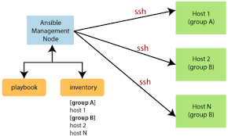

# ANSIBLE

- Ansible is simple open source IT engine which automates application deployment, intra service orchestration, cloud provisioning and many other IT tools.

- Ansible provides open-source automation that reduces complexity and runs everywhere. Using Ansible lets you automate virtually any task. Here are some common use cases for Ansible:

- Eliminate repetition and simplify workflows

- Manage and maintain system configuration

- Continuously deploy complex software

- Perform zero-downtime rolling updates

**Ansible is Agentless:**

- Ansible is Agentless it operates over SSH, Instead of relying on agents running on managed hosts, Ansible connects to them remotely via SSH or WinRM (for Windows hosts). This architecture eliminates the need for deploying and managing agent software on every target system, simplifying the setup and reducing overhead.

**Enhanced Security:**

-It provide secure channel as there’s no need to manage credentials or keys on the managed hosts, as Ansible authenticates using SSH keys or credentials provided at runtime.

**Ansible-playbooks**

- Playbooks are automation blueprints, in YAML format, that Ansible uses to deploy and configure managed nodes.

**Ansible modules**

- Ansible modules are units of code that can control system resources or execute system commands. Ansible provides a module library that we can execute directly on remote hosts or through playbooks. 

**Ansible workflow**

 

- Ansible works by connecting to our nodes and pushing out small programs, called "Ansible modules" to them.
-  Ansible then executes these modules (over SSH by default), and removes them when finished.
- The controlling node  which controls the entire execution of the playbook.It’s the node from which we are running the installation and The inventory file provides the list of hosts where the Ansible modules needs to be run and the management node does a SSH connection and executes the small modules on the hosts machine and installs the product/software.

 

